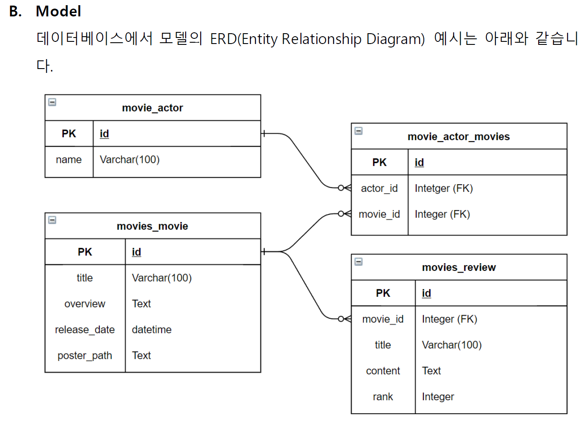
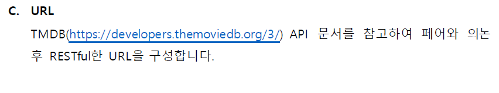
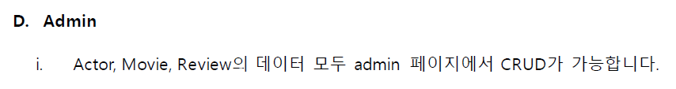
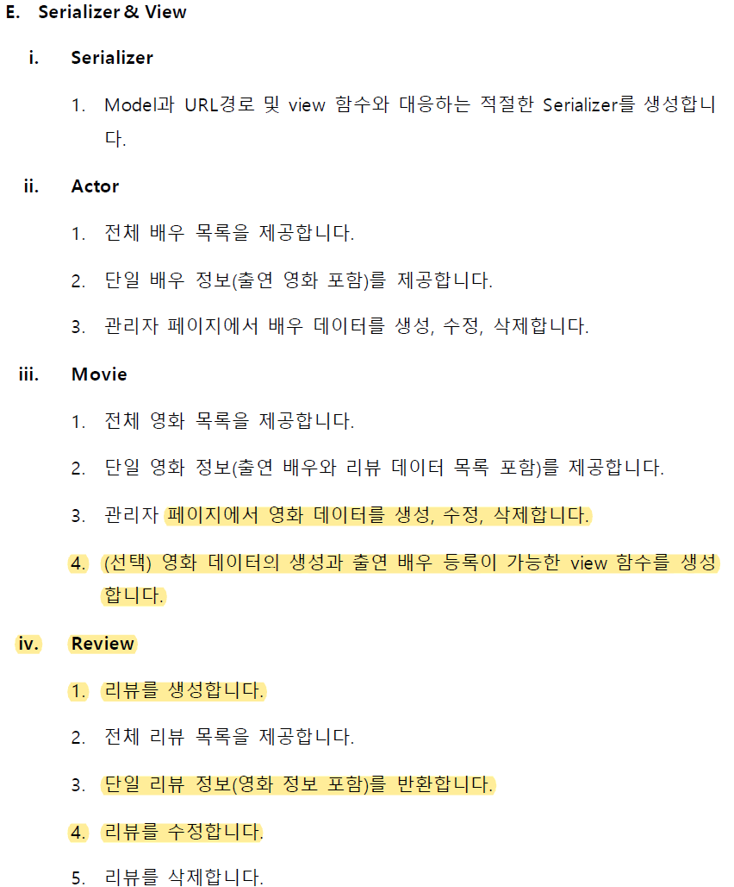

B. Model




```python
from django.db import models
from django.db.models.fields import TextField

# Create your models here.

class movie_actor(models.Model):
    name = models.CharField(max_length=100)

    def __str__(self):
        return self.name

class movies_movie(models.Model):
    title = models.CharField(max_length=100)
    overview = models.TextField()
    release_date = models.DateTimeField(auto_now_add=True)
    poster_path = TextField()
    
    def __str__(self):
        return self.title

class movie_actor_movies(models.Model):
    actor_id = models.ForeignKey(movie_actor, on_delete=models.CASCADE)
    movie_id = models.ForeignKey(movies_movie, on_delete=models.CASCADE)


class movies_review(models.Model):
    movie_id = models.ForeignKey(movies_movie, on_delete=models.CASCADE)
    title = models.CharField(max_length=100)
    content = models.TextField()
    rank = models.IntegerField()
    
    def __str__(self):
        return self.title
```


C. URL



```python
from django.urls import path
from . import views

app_name = 'movies'
urlpatterns = [
    # path('movie_1', views.movies_movie_1, name='movie_1'),
    # path('movie_2', views.movies_movie_2, name='movie_2'),
    # path('movie_3', views.movies_movie_3, name='movie_3'),

    path('actors/', views.actors_list),
    path('actors/<int:actors_pk>/', views.actors_detail),
    path('movies/', views.movies_list),
    path('movies/<int:movies_pk>/', views.movies_detail),
    path('reviews/', views.reviews_list),
    path('reviews/<int:reviews_pk>/', views.reviews_detail),
    path('movies/<int:movies_pk>/reviews/', views.reviews_create),
]
```


D. Admin



```python
from django.contrib import admin
from .models import movie_actor, movie_actor_movies, movies_movie, movies_review
# Register your models here.

admin.site.register(movie_actor)
admin.site.register(movie_actor_movies)
admin.site.register(movies_movie)
admin.site.register(movies_review)
```


E. Serializer & View



```python
from django.db.models import fields
from rest_framework import serializers
from .models import movie_actor, movies_movie, movies_review

class ActorListSerializer(serializers.ModelSerializer):

    class Meta:
        model = movie_actor
        fields = '__all__'

class MovieListSerializer(serializers.ModelSerializer):

    class Meta:
        model = movies_movie
        fields = ('title',)
class ReviewListSerializer(serializers.ModelSerializer):

    class Meta:
        model = movies_review
        fields = ('title',)

class ActorSerializer(serializers.ModelSerializer):
    class ActorMovieSerializer(serializers.ModelSerializer):
        class Meta:
            model = movie_actor
            fields = '__all__'
    actormovies = ActorMovieSerializer(many=True, read_only=True)

    class Meta:
        model = movies_movie
        fields = ('name','actormovies')

class ReviewSerializer(serializers.ModelSerializer):

    class Meta:
        model = movies_review
        fields = ('title',)

class MovieSerializer(serializers.ModelSerializer):
    
    review_set = ReviewSerializer(many=True, read_only=True)
    # review_count = serializers.IntegerField(source='review_set.count', read_only=True)

    class Meta:
        model = movies_movie
        fields = '__all__'
```

소감


최현준

* 페어로 진행한 장고 DB 프로젝트를 통해 혼자서 프로그래밍을 할 때는 빠르게 발견하지 못한 오타를 조기에 식별하고, 오류 발생시 같이 토의하여 문제를 해결하므로써 시간을 효율적으로 사용할 수 있었다. 페어 프로그램은 거듭할 수록 단점은 사라지고 장점이 더 부각되는 것이 느껴지며 앞으로도 많은 협업 경험을 통해 개발자들과 소통할 수 있는 역량을 갖추고 싶다.

